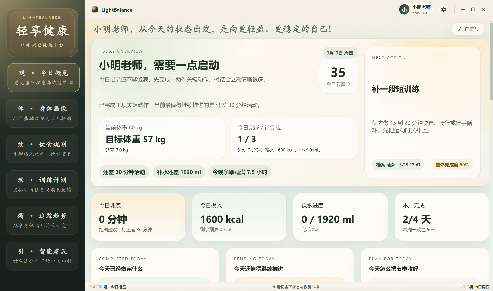

<p align="center">
  <br>
  
  <br>
</p>
<p align="center">
  <a href="https://www.electronjs.org/"></a>
  <a href="https://vuejs.org/"></a>
  <a href="https://www.typescriptlang.org/"></a>
  <a href="https://vitejs.dev/"></a>
  <a href="https://www.npmjs.com/package/mysql2"></a>
</p>

# LightBalance

LightBalance 是一个基于 `Electron + Vue 3 + TypeScript + MySQL` 的桌面健康管理应用原型，围绕体重管理、身体档案、饮食记录、训练追踪和智能建议构建了一套一体化桌面工作台。

## 页面模块

- `MainWindow.vue`：应用主框架与模块导航
- `LoginRegister.vue`：登录 / 注册入口
- `ProfilePanel.vue`：个人资料与账户设置
- `Overview.vue`：今日概览
- `Body.vue`：身体画像与目标设定
- `Diet.vue`：饮食规划与饮水记录
- `Exercise.vue`：训练计划与周进度
- `Trend.vue`：追踪趋势与阶段分析
- `Assistant.vue`：智能建议与问答助手

## 项目结构

```text
.
├─ src/
│  ├─ services/                   后端服务
│  │  ├─ backend/                 数据访问与桥接封装
│  │  │  ├─ electron/             Electron 主进程与桌面逻辑
│  │  │  │  └─ db/                数据库连接、查询与业务读写
│  │  ├─ composables/             渲染层组合式逻辑
│  │  └─ types.ts                 共享类型定义
│  ├─ views/                      前端页面
│  └─ index.html                  Vite 入口页面
├─ .env.example                   环境变量示例
├─ package.json                   项目脚本与依赖配置
├─ tsconfig.json                  TypeScript 配置
└─ README.md                      项目说明文档
```

## 开发环境准备

### 1. 环境要求

- 下载安装`Node.js == v24.14.0 (LTS)`(https://nodejs.org/zh-cn/download)
- 建议使用管理员权限运行 PowerShell 安装
- 可访问的 MySQL 实例

安装成功后验证版本：
```powershell
node -v # 验证 Node.js 版本，输出 v24.14.0

npm -v # 验证 npm 版本，输出 11.9.0
```

### 2. 安装依赖

```powershell
npm install # 项目根目录下执行
```

### 3. 配置环境变量

复制 `.env.example` 为 `.env`，并根据本地环境填写配置。

### 4. 启动开发环境

```powershell
npm run dev # 项目根目录下执行
```

## 开发说明

1. 每个页面都对应具体的文件名称，页面模块名称与文件名称保持一致。前端页面位于 `src/views`，后端逻辑位于 `src/services`，数据库逻辑位于 `src/electron/db`，这几个目录下通常是同名文件。为了尽量减少协作过程中的合并冲突，建议大家优先只修改自己负责页面对应的文件，尽量不要跨模块改动。

2. 数据库支持连接和修改，相关配置写在 `.env` 中。开发过程中可以根据需要新增表单或补充数据内容，以丰富页面展示和功能，但原则上尽量不要随意修改或删除已有内容，避免对其他模块或整体功能造成影响。

3. 目前各个页面的基础开发已经大致完成，但整体更偏向静态展示。接下来主要需要从交互性、功能性以及界面文案三个方面继续优化，可以参考之前的文档找思路，也可以结合自己的理解大幅度重新设计和调整自己负责的页面。

4. **任务分配如下：Wu 负责前两个页面，即 `overview` 和 `body`；Lan 负责中间两个页面，即 `diet` 和 `exercise`；Su 负责第五个页面以及个人账号和设置相关内容，即 `trend` 和 `profilePanel`，其中后端数据库对应为 `auth`。**

5. 各个页面的功能实现方向需要把握清楚。
- 今日概览：主要强调当天任务的展示，要能够根据之前设定的计划，明确用户今天需要完成什么、已经完成了什么、还有什么没有完成，例如今日饮食、训练情况、当天的日历安排等，最好做成一个直观的看板，并在此基础上增加一些功能性和互动操作。
- 身体画像：更偏向于展示用户的减重情况和个人健康档案，需要优化 UI 设计，增强界面的操作性和互动性，同时让展示的数据更加合理。
- 饮食规划：则更侧重于饮食安排和营养参考，需要修正主要营养参数，突出科学性，最好能做出每日饮食规划，并展示当前已经摄入了什么、还缺少哪些营养，以及如何补充，同时增强页面的功能性和交互性。
- 训练计划：仍然要围绕已完成内容的展示和未完成内容的规划展开，在优化界面设计的同时，可以考虑增加训练计时器等小功能，增强互动体验。
- 追踪趋势：重点是展示一段时间内的数据统计图表，例如这段时间的训练情况、饮食情况、体重走势等，目的是做成一个能够反映长期趋势和效果的数据看板，因此这一页建议大幅重新设计 UI。
- 个人信息和设置：目前在同一个 Vue 页面中，但其中实际上包含了两个界面，点击右上角“小明老师”或设置图标后分别进入不同页面，这部分目前设计和功能都还比较简单，可以自由发挥，尽量把内容和功能丰富起来。

6. 以下是我设备上的运行界面，如有错位或显示差异，请及时告知，避免开发完成后在我的设备上出现 UI 不适配。因为最终需要在我的设备上做展示答辩。

<p align="center">
  
</p>

## GitHub 提交 Commit 规范

提交信息建议遵循以下格式：

```text
type(scope): description
```

- `type`：提交类型
- `scope`：影响范围，可选
- `description`：本次变更的简短说明

### 常见 type 类型

| Type | 说明 |
| --- | --- |
| `feat` | 新功能 |
| `fix` | 修复问题 |
| `docs` | 文档修改 |
| `style` | 格式调整，不影响逻辑 |
| `refactor` | 重构 |
| `perf` | 性能优化 |
| `test` | 测试相关 |
| `build` | 构建或依赖变更 |
| `chore` | 杂项修改 |

### 示例

```text
feat(body): 增加体重与 BMI 变化趋势展示
fix(diet): 修复饮食记录热量计算错误
docs(readme): 补充项目启动与环境配置说明
refactor(db): 重构数据库连接与查询封装
chore(project): 清理无用静态资源文件
```
