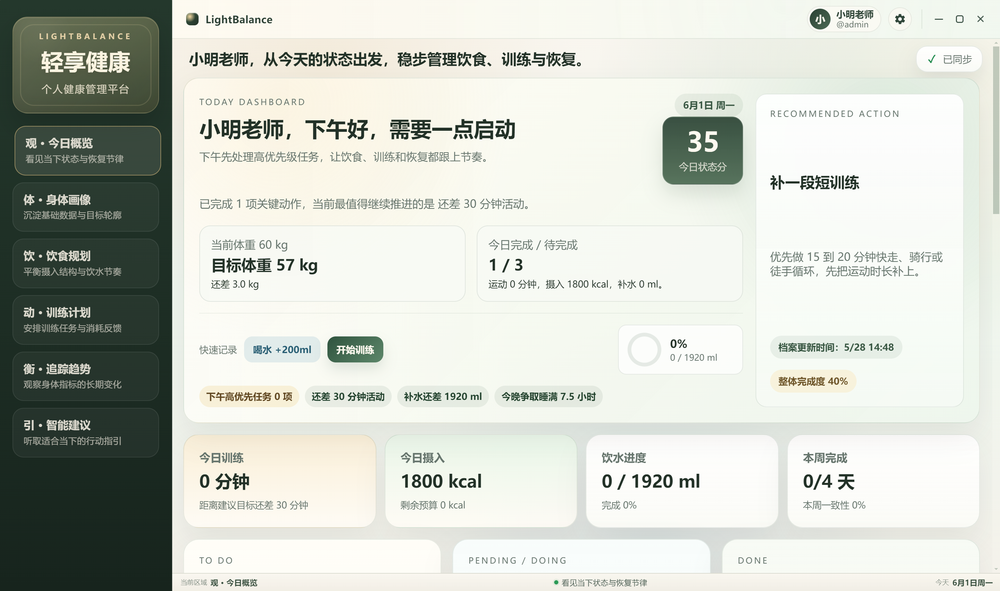

# LightBalance

<p align="center">
  
</p>

<p align="center">
  <a href="https://www.electronjs.org/"></a>
  <a href="https://vuejs.org/"></a>
  <a href="https://www.typescriptlang.org/"></a>
  <a href="https://vitejs.dev/"></a>
  <a href="https://www.npmjs.com/package/mysql2"></a>
</p>

LightBalance 是一款基于 `Electron + Vue 3 + TypeScript + MySQL` 的桌面端个人健康管理应用。项目围绕体重档案、饮食记录、训练计划、趋势追踪和智能建议构建，帮助用户把分散的健康数据整理成清晰的每日行动和长期反馈。

## 功能概览

- 账户登录与注册：支持本地 MySQL 账户体系，密码使用 `scrypt` 哈希存储。
- 今日概览：汇总当天饮食、训练、身体指标和恢复状态。
- 身体画像：维护年龄、性别、身高、体重、体脂率、目标体重、作息和生活习惯等档案信息。
- 饮食规划：记录餐食、热量、宏量营养素和饮水量，支持新增、编辑、删除饮食记录。
- 训练计划：管理训练项目、完成状态、运动时长和消耗数据。
- 趋势追踪：展示体重、BMI、摄入、消耗、睡眠等阶段性变化。
- 智能建议：可接入兼容 OpenAI 接口格式的模型服务，生成健康计划、问答建议并测试模型连接。
- 桌面体验：提供自定义登录窗口、主窗口、导航栏、标题栏和窗口控制按钮。

## 运行环境

- Node.js `>= 18`
- npm
- MySQL `8.0+` 或兼容版本
- Windows / macOS / Linux 桌面环境

当前项目依赖版本见 [package.json](package.json)。

## 快速开始

### 1. 安装依赖

```powershell
npm install
```

### 2. 初始化数据库

建表脚本会自动创建 `lightbalance` 数据库：

```powershell
mysql -u your_mysql_user -p < src/sql/lightbalance.schema.sql
```

如果需要导入演示数据，可以继续执行：

```powershell
mysql -u your_mysql_user -p lightbalance < src/sql/lightbalance.data.sql
```

SQL 文件说明：

| 文件 | 用途 |
| --- | --- |
| `src/sql/lightbalance.schema.sql` | 数据库和表结构初始化脚本 |
| `src/sql/lightbalance.data.sql` | 演示/初始化数据 |
| `src/sql/lightbalance.backup.sql` | 完整备份，通常用于恢复当前开发库状态 |

### 3. 配置环境变量

复制 `.env.example` 为 `.env`，并按本地环境填写：

```env
LIGHTBALANCE_DB_HOST=127.0.0.1
LIGHTBALANCE_DB_PORT=3306
LIGHTBALANCE_DB_USER=your_mysql_user
LIGHTBALANCE_DB_PASSWORD=your_mysql_password
LIGHTBALANCE_DB_NAME=lightbalance

LIGHTBALANCE_GEMINI_BASE_URL=https://new.lemonapi.site/v1
LIGHTBALANCE_GEMINI_MODEL=[L]gemini-2.5-flash
LIGHTBALANCE_GEMINI_API_KEY=your_gemini_api_key_here
```

数据库配置为必填项。智能建议模块依赖模型接口配置；如果暂时不使用该模块，可以先不填写有效 API Key，但模型连接测试和问答功能将不可用。

### 4. 开发模式运行

```powershell
npm run dev
```

该命令会启动 Vite 开发服务，并自动打开 Electron 客户端。Vite 固定监听 `http://127.0.0.1:5173`，如果端口被占用，请先释放该端口。

### 5. 生产模式预览

```powershell
npm run preview
```

该命令会先执行类型检查和生产构建，再通过 Electron 加载构建后的页面。

## 可用脚本

| 命令 | 说明 |
| --- | --- |
| `npm run dev` | 启动 Vite 开发服务并运行 Electron |
| `npm run typecheck` | 执行 Vue / TypeScript 类型检查 |
| `npm run build` | 类型检查通过后生成生产构建 |
| `npm run preview` | 构建生产产物并以 Electron 方式运行 |

## 项目结构

```text
.
├── docs/images/                      项目截图
├── src/
│   ├── index.html                    Vite 渲染入口
│   ├── sql/                          MySQL 建表和数据脚本
│   ├── views/                        Vue 页面与桌面界面
│   │   ├── AppRoot.vue               登录窗口 / 主窗口入口选择
│   │   ├── LoginRegister.vue         登录与注册
│   │   ├── MainWindow.vue            主框架、导航和窗口控制
│   │   ├── Overview.vue              今日概览
│   │   ├── Body.vue                  身体画像
│   │   ├── Diet.vue                  饮食规划
│   │   ├── Exercise.vue              训练计划
│   │   ├── Trend.vue                 趋势追踪
│   │   ├── Assistant.vue             智能建议
│   │   └── ProfilePanel.vue          个人资料与账户设置
│   └── services/
│       ├── main.ts                   Vue 应用启动与全局样式
│       ├── types.ts                  共享类型定义
│       ├── composables/              前端组合式逻辑
│       └── backend/
│           ├── *.ts                  渲染层服务封装
│           └── electron/             Electron 主进程
├── .env.example                      环境变量示例
├── package.json                      脚本与依赖配置
├── tsconfig.json                     TypeScript 配置
└── vite.config.js                    Vite 配置
```

## 界面预览

<p align="center">
  
</p>
